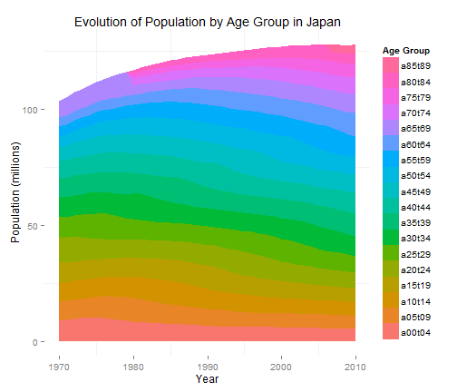
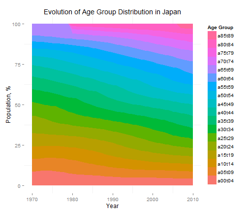
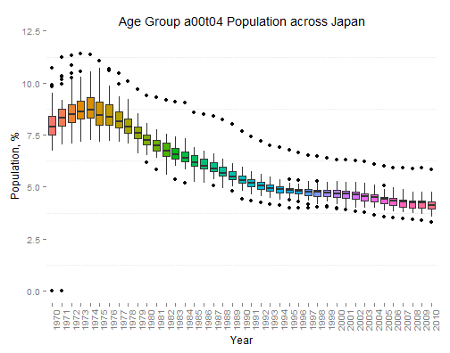
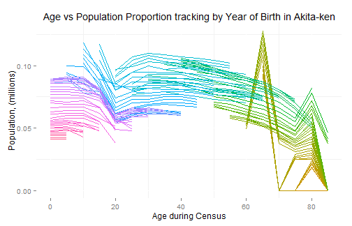

## Introduction to Japan Population Estimates

1. The problem we want to visualize today is how the demographics of Japan has evolved between 1970 to 2010. We are particularly interested on Population growth (or decline) and on the Age of the population.
2. The data is downloaded from [Statistics Bureau](http://www.stat.go.jp/english/data/jinsui/2.htm) via the [Portal Site of Official Statistics of Japan](http://www.e-stat.go.jp/). 
3. The data we are interested in is the Time Series of the Population by 5-year Age Group for Prefectures [[1](http://www.e-stat.go.jp/SG1/estat/ListE.do?bid=000000090004&cycode=0)],[[2](http://www.e-stat.go.jp/SG1/estat/ListE.do?bid=000001039703&cycode=0)]
4. This dataset will allow us to Visualize the growth or decline of the Population for each Prefecture, and for each 5-Year Age Group
5. We can also visualize how the population with the same birth year grows or decline in time
6. Note that there were 2 reclassification of Age Group between 1970 - 2010
  * 1980 : Age Group 65+years old reclassified into 70-74, 75-89 and 80+ years old 
  * 2007 : Age Group 80+years old reclassified into 80-84 and 85+ years old 

--- &twocol w1:45% w2:45%

## Population in Japan is growing slower
The application clearly shows that while the Japanese population is growing, the median age is increasing. New born rate seems to be decreasing resulting slower growth.

*** =left

 

*** =right

 

--- &twocol w1:45% w2:45%

## The population is getting older

The application demonstrates that the proportion of older Age Group in Japan is growing while the proportion of the younger Age Group is decreasing. The percentage of Age Group 70 - 75 years old surpassed the Age Group 0 - 4 years old somewhere in 2003.

*** =left

 

*** =right

 

--- &twocol w1:45% w2:45%

## Population migration happens at age 20-30 yrs old

The application tracks the total population of habitants with the same year of birth (Each line is for one year of birth). Increasing slope is due to immigration while decreasing slope are due to emigration and natural causes. The movement at this age range is most likely due to tertiary education and entering the job market in another city.
*** =left

 

*** =right

 
